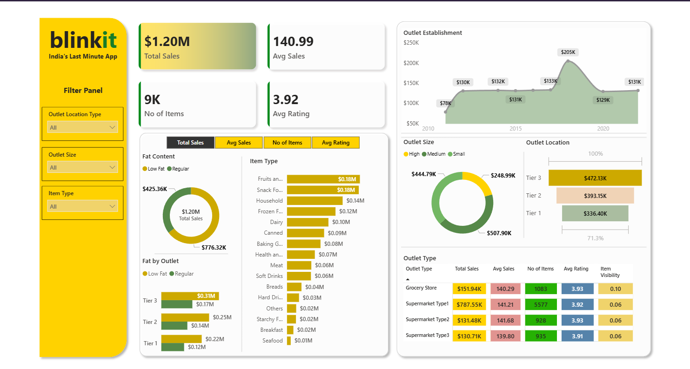

### 📌 Overview
An exploratory data analysis (EDA) of Blinkit's grocery sales data using Python. The project analyzes sales performance across product types, outlet characteristics, and geographic tiers — uncovering patterns in customer preferences and outlet efficiency through KPI computation and data visualization.

### 🛠️ Tech Stack
- **Python** – Core analysis language
- **Pandas** – Data loading, cleaning, and aggregation
- **NumPy** – Numerical computations
- **Matplotlib** – Custom chart plotting
- **Seaborn** – Statistical visualizations

### 📂 Dataset
- **Source:** `BlinkIT Grocery Data.csv`
- **Key columns:** `Item Fat Content`, `Item Type`, `Sales`, `Rating`, `Outlet Size`, `Outlet Location Type`, `Outlet Establishment Year`

### 🧹 Data Cleaning
Standardized inconsistent label values in the `Item Fat Content` column before analysis:

| Raw Value | Cleaned Value |
|-----------|--------------|
| `LF` | `Low Fat` |
| `low fat` | `Low Fat` |
| `reg` | `Regular` |

### 📊 KPIs Computed

| KPI | Description |
|-----|-------------|
| **Total Sales** | Sum of all sales (`$`) across the dataset |
| **Average Sales** | Mean sales value per entry |
| **No. of Items Sold** | Total count of sales transactions |
| **Average Rating** | Mean customer rating across all outlets |

### 📈 Charts & Visualizations

| Chart | Type | What It Shows |
|-------|------|---------------|
| Sales by Fat Content | Pie Chart | Revenue share between Regular vs. Low Fat items |
| Total Sales by Item Type | Bar Chart | Top-performing grocery categories ranked by revenue |
| Fat Content by Outlet Tier | Grouped Bar Chart | Low Fat vs. Regular sales split across Tier 1 / 2 / 3 cities |
| Sales by Outlet Establishment Year | Line Chart | Revenue trend correlated with outlet age/maturity |
| Sales by Outlet Size | Pie Chart | Revenue distribution across Small, Medium, and Large outlets |
| Sales by Outlet Location Type | Horizontal Bar Chart | City-tier wise total sales comparison |

### ✨ Key Highlights
- Conducted end-to-end EDA: raw CSV ingestion → data profiling (`shape`, `dtypes`, `unique()`) → cleaning → KPI computation → multi-chart visualization.
- Handled real-world data quality issues with targeted Pandas `replace()` operations before any aggregation.
- Added inline data labels on bar and line charts for immediate readability.
- Structured the notebook as a clean, reproducible analytical workflow — from exploration to insight delivery.

### 📈 Business Impact
- Pinpoints which **item types and fat content categories** drive the most revenue, directly informing procurement and shelf-space allocation decisions.
- Reveals how **outlet tier and size** correlate with sales, supporting data-driven expansion strategy and resource planning.
- The **establishment year trend** highlights an outlet maturity curve, helping operations teams benchmark performance of new vs. established stores.

---

## 🧑‍💻 About

These projects were built as part of a hands-on data analytics learning journey, applying real-world business scenarios to develop skills in data modeling, visualization, storytelling with data, and BI tool optimization.

**Tools & Technologies across portfolio:** Excel · Power Query · DAX · Power BI · SQL (MySQL) · DAX Studio · Python · Pandas · NumPy · Matplotlib · Seaborn · GitHub LFS

## 📊 Dashboard Preview

